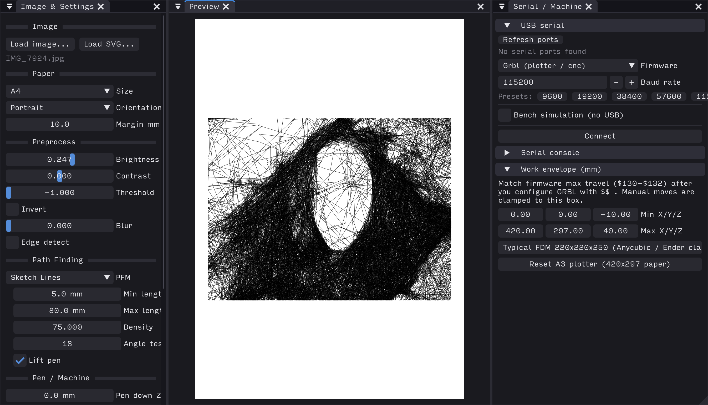

# ofxPlotter

Pen-plotter orchestration for openFrameworks: mm-space paper layout, raster preprocessing, SVG import, and G-code export for GRBL-based machines.

**Plot finding** (image-to-stroke algorithms) lives in [ofxPlotFinders](https://github.com/ofxyz/ofxPlotFinders). **Stroke processing** (merge, sort, filter, …) lives in [ofxPlotProcessors](https://github.com/ofxyz/ofxPlotProcessors). This addon wires them into `ImageToPath` and handles export, pen settings, and layer state.

## Features

- **`ImageToPath`** — paper sizes, margins, preprocessing, layer hierarchy (EnTT), per-layer paths and stats
- **SVG import** — vector outlines into layers (groups, colours, or single layer); optional fill rasterization for pen simulation
- **Multi-layer jobs** — per-layer finder choice, brush, colour, visibility, and hierarchy
- **G-code export** — `plotter::toGCode()` with pen Z, feed rates, machine prefs, zones, optional pipeline
- **Helpers** — bed coordinates, plotter zones, G-code injection hooks, stroke bridge to processors

Plot finder algorithms (Sketch Lines, Cross-Hatch, Spiral, Stippling, Contours) are documented in [ofxPlotFinders](https://github.com/ofxyz/ofxPlotFinders).

## Dependencies

| Addon | Role |
|-------|------|
| [ofxPlotFinders](https://github.com/ofxyz/ofxPlotFinders) | Raster → polyline algorithms (used by `ImageToPath::generate`) |
| [ofxPlotProcessors](../ofxPlotProcessors) | Optional polyline pipeline before export |
| [ofxGCode](https://github.com/ofxyz/ofxGCode) | Path-to-G-code serialisation |
| [ofxSvg](https://github.com/openframeworks/openFrameworks/tree/master/addons/ofxSvg) | SVG vector import (bundled with OF) |
| [ofxGrbl](https://github.com/ofxyz/ofxGrbl) | Machine connection (examples / apps) |
| [ofxKit](https://github.com/ofxyz/ofxKit) | UI in `example-kit` |
| [ofxEnTTKit](https://github.com/ofxyz/ofxEnTTKit) | Layer / hierarchy ECS components |

Apps that list **ofxPlotter** in `addons.make`; `addon_config.mk` pulls in PlotFinders and PlotProcessors automatically.
